<div align="center">

  <h1>Synapto</h1>

  <p align="center">
    <strong>Synaptic Weight Eviction (SWE) Engine for Dynamic LLM Memory Consolidation</strong>
  </p>

  <br>

  <a href="https://pypi.org/project/synapto-llm/">
    
  </a>
  <a href="https://lbesson.mit-license.org/">
    
  </a>
  <a href="https://pypi.org/project/synapto-llm/">
    
  </a>

</div>

<br>

<div align="center">
<br>
<div align="center">
  
</div>

<br>
</div>

<br>

###  Overview

`synapto` is an open-source PyTorch framework implementing native online memory consolidation for Large Language Models. Instead of relying indefinitely on expanding KV-caches or external RAG vector databases, `synapto` intercepts evicted token blocks during inference, evaluates their surprisal score, and consolidates high-value information directly into an unquantized dynamic memory layer (top 10-15% of model weights) using real-time micro-backpropagation.

<br>

###  Comparative Architecture Matrix

| Feature | Standard KV-Cache | RAG Retrieval | Synapto (SWE Engine) |
| :--- | :---: | :---: | :---: |
| **Memory Location** | VRAM Context Window | External Vector DB | **Model Weights (FP16 Top Layers)** |
| **Compute Complexity** | $O(N^2)$ Quadratic Explosion | Search & Latency Overhead | **Zero Prompt Overhead ($O(1)$)** |
| **Information Recall** | Lost upon cache eviction | Fragmented search snippets | **Native Weight-Based Generation** |
| **Privacy / Encryption** | Plain VRAM text | Unencrypted DB records | **E2E AES-256 + Salt & Pepper** |
| **Hardware Requirement** | High VRAM per session | DB Server + API Host | **~5.5 GB VRAM for 7B Models** |

<br>

###  System Architecture & Data Flow

```
[ Incoming Token Stream ]
            │
            ▼
[ KV-Cache Window ] ──(Context Eviction)──► [ Surprisal Score Gate ]
                                                       │
                                                       ▼ (If Loss > Threshold)
[ Static 4-bit Base ]  ◄──(Micro-Backprop)─── [ Dynamic FP16 Memory Layers ]
(85% Frozen NF4 Weights)                        (Elastic Weight Anchoring)
```

* **Static Base Core (80-90%):** Quantized to 4-bit NF4 using `bitsandbytes` to minimize VRAM usage (~3.8 GB for Qwen 2.5 7B).
* **Dynamic Memory Layers (10-20%):** Kept in native FP16/BF16 to receive gradient updates in milliseconds (~1.2 GB VRAM).
* **Plasticity Parameter ($P \in [-1.0, 2.0]$):** Dynamically scales the learning rate ($\eta$) and surprisal threshold ($\tau$).
* **Elastic Weight Anchoring:** $L_2$ regularization penalty against baseline weights prevents weight drift and reasoning decay.
* **Multi-Sample Replay Buffer:** Samples up to 3 historical facts during micro-backpropagation to prevent catastrophic forgetting.

<br>

###  Installation

```bash
pip install synapto-llm
```

#### Dependencies:
`torch>=2.0.0`, `transformers>=4.40.0`, `bitsandbytes>=0.43.0`, `safetensors>=0.4.0`, `accelerate>=0.28.0`, `cryptography>=41.0.0`.

<br>

###  Code Examples

#### 1. Manual Fact Consolidation & Pure Weight Recall

```python
from synapto import SynaptoEngine

# Initialize SWE engine for Qwen 2.5 7B with Plasticity P = 1.5
engine = SynaptoEngine(
    model_id="Qwen/Qwen2.5-7B-Instruct", 
    p_value=1.5, 
    dynamic_layers=4
)

prompt = "Secret passcode for NervOS core:"
completion = " 8821-NERV-PRO."

# Consolidate fact into dynamic top weights upon context eviction
engine.consolidate(prompt, completion)

# Generate response purely from updated model weights (no tokens in KV-cache)
response = engine.generate_response(prompt)
print(f"Model Recall: {response}")

# Export dynamic memory weights with E2E encryption
engine.save_memory_profile("user_memory.safetensors", encryption_key="master_password_123")
```

#### 2. Streaming Chat Processor ($O(1)$ Token History Tracking)

```python
from synapto import SynaptoEngine, ChatStreamProcessor

engine = SynaptoEngine(model_id="Qwen/Qwen2.5-7B-Instruct", p_value=1.5)
processor = ChatStreamProcessor(engine, max_window_tokens=512)

# As dialogue exceeds 512 tokens, evicted turns automatically consolidate into weights
processor.process_turn("My safe passcode is 9942-ALPHA.", "Got it, saved securely.")
```

#### 3. Inspecting Consolidated Memories & Session Reset

```python
# Inspect all facts currently consolidated into active memory
memory_journal = engine.get_memory_dump()
for entry in memory_journal:
    print(f"Fact: {entry['prompt']} -> {entry['completion']} | Surprisal: {entry['surprise_score']:.3f}")

# Reset dynamic memory weights back to baseline in 0.001 seconds
engine.reset_memory()
```

<br>

###  Production Server Deployment Pattern

Production multi-tenant FastAPI server implementation featuring user session profile switching, E2E metadata encryption, and automated memory persistence:

```python
import os
from fastapi import FastAPI, HTTPException, Header
from pydantic import BaseModel
from synapto import SynaptoEngine, ChatStreamProcessor

app = FastAPI(title="Synapto Production Inference Server")

# Global model instance (loaded once into VRAM)
engine = SynaptoEngine(model_id="Qwen/Qwen2.5-7B-Instruct", p_value=1.5)
processors = {}

class ChatRequest(BaseModel):
    user_id: str
    message: str

class ChatResponse(BaseModel):
    response: str
    consolidated_facts_count: int

@app.post("/v1/chat", response_model=ChatResponse)
async def chat_endpoint(request: ChatRequest, x_user_key: str = Header(None)):
    user_id = request.user_id
    profile_path = f"profiles/{user_id}.safetensors"

    if user_id not in processors:
        processors[user_id] = ChatStreamProcessor(engine, max_window_tokens=512)

    # Load user-specific dynamic memory profile from disk
    if os.path.exists(profile_path):
        engine.load_memory_profile(profile_path, encryption_key=x_user_key)

    # Generate response
    response_text = engine.generate_response(request.message)

    # Process chat turn and auto-consolidate evicted tokens
    processor = processors[user_id]
    processor.process_turn(request.message, response_text)

    # Save updated user memory profile back to disk
    os.makedirs("profiles", exist_ok=True)
    engine.save_memory_profile(profile_path, encryption_key=x_user_key)

    return ChatResponse(
        response=response_text,
        consolidated_facts_count=len(engine.get_memory_dump())
    )
```

<br>

###  Security & Cryptographic Specifications

* **Zero-Trust Weight Storage:** Memory profiles are saved exclusively in `.safetensors` format, blocking arbitrary code execution (pickle execution attacks).
* **E2E Metadata Encryption (`CryptoVault`):** Session journals and replay buffers are encrypted using AES-256-CBC with PBKDF2 key derivation, cryptographic salt, and system pepper.
* **Target Loss Masking:** Prompt tokens are masked (`ignore_index=-100`) during micro-backpropagation using exact tokenized chat template boundaries, preventing prompt contamination and preserving general model reasoning.
* **Path Traversal Sanitization:** Strict filepath validation (`SafetyUtils.validate_and_sanitize_path`) enforces extension restrictions (`.safetensors`, `.json`, `.enc`) and canonical path checking.

<br>

###  License

Developed independently by **Bodya**. Released under the [MIT License](LICENSE).